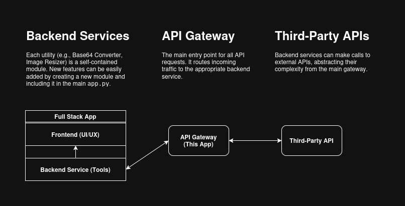

# RIT-Multi-Utility-Tools
A multi-utility tool API built with FastAPI and a modular, gateway-style architecture. This repository contains the core API gateway and a sample feature to demonstrate the plug-and-play system.

# Getting Started 
Still local-testing for now OK (˶ᵔ ᵕ ᵔ˶)
This guide will help you set up and run the FastAPI application locally for testing.

First-off all, make sure to set an virtual environment (˶˃ ᵕ ˂˶) !!
Read more about venv [here.](https://docs.python.org/3/library/venv.html)

# Prerequisites
- Python 3.8+
- pip
- venv

# Setup and Installation

## 1. Clone this repo:
```bash
git clone [repository-url]
cd [your-repository-folder]
```

## 2. Create and activate virtual environment:
```bash
python -m venv venv
# On Windows
.\venv\Scripts\activate
# On macOS / Linux
source venv/bin/activate
```

## 3. Install dependencies:
```bash
pip install -r requirements.txt
```

# Running the API Server
## Start FastAPI Server:
```bash
uvicorn main:app --reload
```

The API will be live at `http://127.0.0.1:8000`. You can access the interactive API documentation at `http://127.0.0.1:8000/docs` to test the endpoints.

So here's the catch.
This is mainly Gateway API. Different from fullstack app included in the demo, **as it should be separate**.

# Architecture Overview
This project uses an API Gateway pattern to create a scalable, plug-and-play system ⸜(｡˃ ᵕ ˂ )⸝♡.

